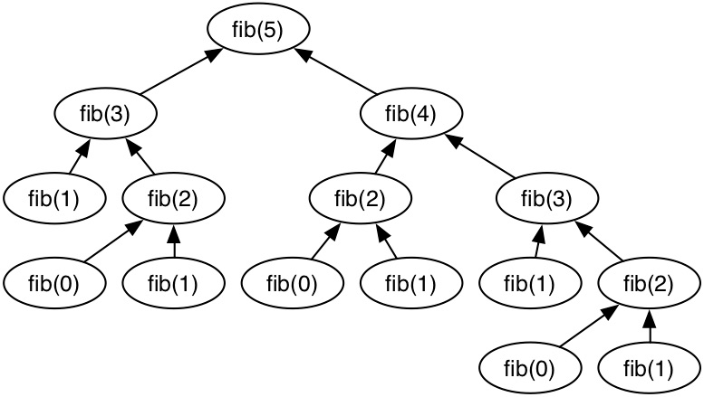
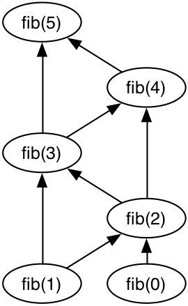

# Parallel Top Down Dynamic Programming through Lock-Free Hash Tables

## Summary
We are going to parallelize top-down dynamic programs by implementing a concurrent lock free hash table. Once we have an implementation of concurrent hash tables, we will analyze the speedup achieved on a selection of dynamic programming recurrence such as shortest paths and the knapsack problem. 

## Background
||
|:--:| 
| *Figure 1* |

||
|:--:| 
| *Figure 2* |

Dynamic programming is a method for solving problems that are easily divisible into smaller subproblems. Oftentimes, many of these problems will need the result of a subproblem multiple times throughout the course of the algorithm. Dynamic programming allows for subproblems to be computed once by storing the results in a dictionary so they can be reused later. Figure 1 shows the recurrence structure for computing the 5th fibonacci number, and Figure 2 shows how dynamic programming can reduce how many times each subproblem is computed by storing the results in a dictionary.

Hash tables are one possible data structure for the implementation of the dictionary used in dynamic programming. Most hash table implementations do not support concurrent operations. Therefore, one of our project deliverables will be a concurrent hash table.

With a concurrent hash table, dynamic programming can be parallelized by having multiple threads compute subproblems in parallel, and once they have the result, they store it in the hashtable. If a thread needs to compute a subproblem where the result is in the hashtable, it will simply read the result and continue, reducing the number of subproblems that will be computed. While there is a chance that some subproblems may be computed multiple times if two threads work on the subproblem at the same time, through either randomization or dynamic assignment of subproblems, duplicate computations can be reduced. 

## Challenges
We expect this problem to have several challenging aspects. To attain significant speedup, we plan to design a lock-free hash table so that threads are not delayed by concurrent accesses to the hash table. Additionally, we will need to address and evaluate the distribution of subproblems among the threads such that the dependencies are minimized. Some ideas of how we can address this are randomizing the assignment or distributing the subproblems manually among the threads through worker thread queues. Another challenging aspect is that the cache locality greatly depends on the distribution of the subproblems and our implementation of the hash table. If the distribution is scattered, this may lead to a scattered distribution of underlying memory accesses. Lastly, we would like to focus on minimizing the number of subproblems that are computed multiple times while maintaining high utilization of resources. Introducing a worker thread queue may also help with this minimization.

## Resources

We will start from scratch and implement our own hash table and parallelization of Bellman-Ford of our choosing in C++ and pthreads. We will develop our program on the GHC clusters and benchmark it on the PSC machines so that we can observe speedups with high core counts. There is one paper that we are referencing that has explored a similar idea of parallelizing dynamic programs.

Alex Stivala, Peter J. Stuckey, Maria Garcia de la Banda, Manuel Hermenegildo, Anthony Wirth,
Lock-free parallel dynamic programming,
Journal of Parallel and Distributed Computing,
Volume 70, Issue 8,
2010,
Pages 839-848,
ISSN 0743-7315,
https://doi.org/10.1016/j.jpdc.2010.01.004.

Our results will expand upon this paper by analyzing a different set of dynamic programming algorithms as well as taking advantage of modern multithreaded processors with higher core counts. 

## Goals

### 75% Goal
We should have a working implementation of a concurrent lock-free hash table and have demonstrated its scalability with high core count processors. At our poster session, we will have speedup graphs for a hash table benchmark that we create.

### 100% Goal
We plan to have an implementation of a lock free concurrent hash table and have gathered speedup data for the shortest path dynamic programming problem. Ideally, we hope to see speedups of greater than 15x compared to single threaded performance as we are running on a system with 128 cores while an older paper saw speedup of 9x with 32 cores. At our poster session, we will have speedup graphs of the performance of shortests paths problem.

### 125% Goal
In addition to analysis of the shortest path problem, we will also have analyzed a suite of other top down dynamic programming problems. These include the knapsack problem, optimal binary search trees, and the traveling sales person problem. Lastly, we can compare the performance of different of different implementations of concurrent hash tables, whether those be locking, lock-free, open addressing, or separate chaining. At our poster session, we will have speedup graphs for the additional problems, as well as a comparison of the performance of different hash tables. 

## Platform Choice

We will impement our program in C++ since it is a high level language that also has great performance. During development, we will test our programs on the GHC machines, but to observe the behavior with high core count cpu's, we will benchmark on the 128 core PSC machines. We believe bencharking on the PSC will reveal parallel bottlenecks that communication overhead that the lower core count GHC machines will not show. 

## Schedule (version 1)

### March 27 - April 2
- Begin work on implementing a lock free hash table. 
### April 3 - 9
- Optimize the performance of the hash table for dynamic programming work loads.
- Begin implementing the framework for parallelizing general top down dynamic programs.
### April 10 - 16
- Begin implementing the shortest paths dynamic programming problem with the parallized framework.
### April 17 - 23
- Finish implementing shortest paths.
- Gather benchmarking data on the PSC machines and optimize the code to improve performance based on findings.
### April 24 - 29
- Gather final speedup graphs and appropriate benchmarking data.
- Finalize report. 

## Schedule (version 2)
After completing our first milestone, we have revised our schedule to include more details and organized in half-week increments. We have denoted who is responsible for each component of the project. 

### March 27 - April 2
- Begin work on implementing a lock free hash table. *(Nikita)*
### April 3 - 9
~~- Optimize the performance of the hash table for dynamic programming work loads.~~
  - Note: Moved to April 20 - 23
- Begin implementing the framework for parallelizing general top down dynamic programs. *(Nikita)*
### April 10 - 13
- Finish implementing the framework for parallelizing general top down dynamic programs. *(Nikita & Adrian)*
### April 13 - 16
- Begin implementing the shortest paths dynamic programming problem with the parallized framework. *(Adrian)*
### April 17 - 20
- Finish implementing shortest paths. *(Adrian)*
- Gather benchmarking data on the hash table on the PSC machines *(Nikita)*
### April 20 - 23
- Gather benchmarking data on DP on the PSC machines *(Adrian)*
- Optimize hash table and DP solver to improve performance based on findings. *(Nikita & Adrian)*
- *Strech* Implement various DP problems (knapsack, optimal BSTs, TSP, etc.) *(Adrian)*
### April 24 - 27
- Gather final speedup graphs and appropriate benchmarking data. *(Adrian)*
- *Strech* Implement different hash tables (locking, separate chaining, etc.) *(Nikita)*
- *Strech* Gather benchmarking data with all hash table implementations *(Nikita)*
### April 27 - 29
- Finalize report. *(Nikita & Adrian)*

## Milestone Report

We have completed an initial implementation of a lock free hash table. We started by developing a linear-probing open addressing hash table that was not thread safe, and resized when the table was full. After thoroughly testing the single-threaded implementation, we began modifying our hash table to be thread safe while being lock free. To do so, we changed the type of our underlying table to C++'s `atomic` type. This then allowed us to use `compare_exhange_strong` which atomically swaps the entry in the table with the new entry if the slot was empty. We have thoroughly tested this lock-free hash table by inserting various keys simultaneously with multiple threads and asserting the table contains the correct entries. 

As we better understand the depth of our project, we have posted a revised schedule above. In terms of our goals, we are still on track to achieving our 100% goal of implementing a lock free hash table, implementing the shortest path DP problem, and creating benchmarks for both implementations. The 125% goal of implementing other DP problems and analyzing them with other implementations of hash tables may not be within our reach given the short timespan of this project. 

For our poster session, we plan to demonstrate an executable solving the shortest paths problem using a lock-free hash table. Along with the aforementioned demo, we plan to present graphs representing the various benchmarking we've performed with our DP algorithm and hash table. 

In terms of issues, we are foreseeing that refinements to our lock-free hash table to include additional features will be difficult as features such as resizing/rehashing are challenging to program lock-free. In addition, developing a generic parallelized top down dynamic programming solver is challenging due to the high level of genericity we are aiming for. Currently, we're working on designing an effective framework for our generic solver. We hope to progress significantly on the latter issue this upcoming week and have tabled the refinements/other implementations of hash tables for a later time within the project. 